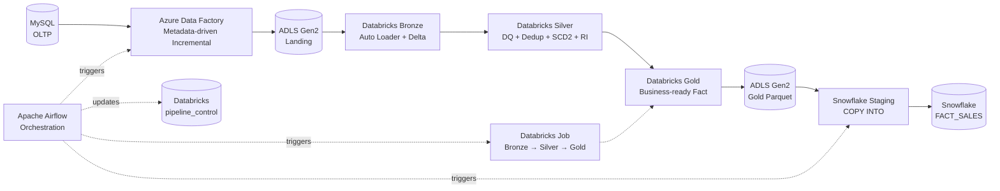
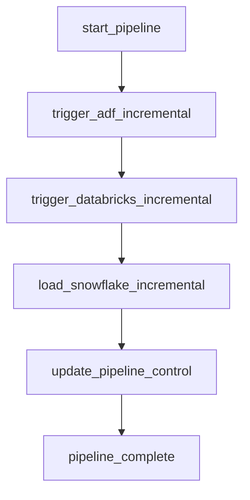

# ShopSphere — E-Commerce Data Engineering Lakehouse


> **End-to-end incremental e-commerce data platform built with MySQL, Azure Data Factory, ADLS Gen2, Databricks/Delta Lake, Snowflake, and Apache Airflow.**

---

## 📌 Project Overview

**ShopSphere** is a production-style e-commerce data engineering project designed to demonstrate how transactional data can be ingested incrementally, validated, transformed through a lakehouse, and served from Snowflake for analytics.

The platform uses a **metadata-driven incremental ingestion pattern** from MySQL, **Auto Loader** for file ingestion into Databricks Bronze, **data quality and referential-integrity checks** in Silver, **SCD Type 2** handling for the customer dimension, and a business-ready Gold fact model that is exported to ADLS and loaded into Snowflake with `COPY INTO` + `MERGE`.

Apache Airflow acts as the external orchestrator and controls the end-to-end sequence.

### Current implementation flow

```text
MySQL
  │
  ▼
Azure Data Factory
  │  Incremental extraction using watermarks
  ▼
ADLS Gen2 / landing
  │
  ▼
Databricks + Delta Lake
  ├── Bronze  → raw incremental ingestion
  ├── Silver  → cleansing / DQ / dedup / SCD2 / RI
  └── Gold    → business-ready fact model
  │
  ▼
ADLS Gen2 / Gold Parquet export
  │
  ▼
Snowflake
  ├── Staging
  └── FACT_SALES via MERGE

Apache Airflow
  └── orchestrates ADF → Databricks → Snowflake → watermark update
```

---

## 🎯 Goals

The project was designed to demonstrate the following real-world data engineering capabilities:

- Incremental extraction from an OLTP database
- Metadata-driven ADF pipelines
- Watermark-based CDC-style processing
- ADLS Gen2 as a cloud data lake
- Databricks Auto Loader for incremental file ingestion
- Delta Lake and Medallion Architecture
- Data quality validation and quarantine/error handling
- Deduplication of source records
- SCD Type 2 for historical customer changes
- Referential-integrity validation between facts and dimensions
- Gold-layer business transformations
- Snowflake external stages and Parquet ingestion
- Snowflake `COPY INTO` and idempotent `MERGE`
- Service-principal-based Databricks Job execution
- Apache Airflow orchestration and retry-safe dependencies
- Watermark advancement only after downstream success
- Cost-conscious serverless execution

---

# 🏗️ Architecture

## High-Level Architecture



## End-to-End Orchestration



### Orchestration rule

The watermark is updated **only after the Snowflake load succeeds**.

```text
ADF success
    ↓
Databricks success
    ↓
Snowflake COPY + MERGE success
    ↓
Update pipeline_control
```

This prevents a downstream failure from incorrectly advancing the watermark and skipping data during a retry.

---

# 🧱 Medallion Architecture

```text
                 ┌──────────────────────────┐
                 │        BRONZE            │
                 │ Raw / Append-oriented    │
                 │ Auto Loader + Delta      │
                 └────────────┬─────────────┘
                              │
                              ▼
                 ┌──────────────────────────┐
                 │        SILVER            │
                 │ Cleaned / Validated      │
                 │ DQ / Dedup / SCD2 / RI   │
                 └────────────┬─────────────┘
                              │
                              ▼
                 ┌──────────────────────────┐
                 │         GOLD             │
                 │ Business-ready analytics │
                 │ Fact + dimensions        │
                 └──────────────────────────┘
```

### Bronze

Purpose: preserve incoming source history with minimal business transformation.

Key characteristics:

- Auto Loader for incremental files
- Delta Lake tables
- Append-oriented ingestion
- Explicit source schema for predictable ingestion
- `_ingested_at` audit timestamp
- `_source_file` lineage metadata
- Raw duplicates preserved for downstream processing

### Silver

Purpose: create reliable analytical entities.

Implemented controls include:

- Null validation
- Format validation
- Business-rule validation
- Deduplication using window functions
- Referential integrity checks
- Error/quarantine tables
- Current-state product handling
- SCD Type 2 customer history

### Gold

Purpose: produce a business-ready order-level fact model.

The Gold fact combines data from:

- Orders
- Customers
- Products
- Payments
- Shipment events

It calculates fields such as gross revenue, total paid, latest payment timestamp, latest shipment status, and carrier information.

---

# 🗄️ Source System

The project uses MySQL database:

```text
SHOPSPHERE_SOURCE
```

### Main source tables

| Table | Purpose | Incremental column |
|---|---|---|
| `customers` | Customer master | `updated_at` |
| `products` | Product master | `updated_at` |
| `orders` | Customer orders | `updated_at` |
| `payments` | Payment events | `payment_ts` |
| `shipments` | Shipment events | `event_ts` |

The source intentionally contains realistic data-engineering challenges such as duplicates, null values, invalid relationships, changing customer attributes, and incremental events.

---

# 🔄 Incremental Ingestion with ADF

The ADF design is **metadata-driven** rather than creating a separate hardcoded pipeline for every table.

### Control metadata

The source metadata contains:

```text
source_table
watermark_column
last_watermark
target_path
is_active
```

### Incremental query pattern

```sql
SELECT *
FROM <source_table>
WHERE <watermark_column> > '<last_watermark>'
  AND <watermark_column> <= NOW();
```

### ADF flow

```text
Lookup source metadata
        ↓
ForEach source table
        ↓
Read current watermark
        ↓
Extract only new/changed rows
        ↓
Copy to ADLS incremental folder
        ↓
Calculate new watermark
        ↓
Persist watermark
```

### Safety principle

The watermark is advanced **only after the corresponding data copy succeeds**.

---

# ☁️ ADLS Gen2 Layout

The main storage container is:

```text
shopsphere
```

Recommended logical layout used by the project:

```text
shopsphere/
│
├── landing/
│   ├── customers/
│   │   ├── initial/
│   │   └── incremental/
│   ├── products/
│   ├── orders/
│   ├── payments/
│   └── shipments/
│
├── bronze/
├── silver/
├── gold/
│   └── serving/
│       └── fact_sales_incremental/
│
└── checkpoints/
    ├── customers/
    ├── products/
    ├── orders/
    ├── payments/
    └── shipments/
```

ADLS is used as the durable cloud landing and interchange layer between ADF, Databricks, and Snowflake.

---

# ⚡ Databricks Auto Loader

Each incremental Bronze notebook uses Databricks Auto Loader.

Example pattern:

```python
df_stream = (
    spark.readStream
    .format("cloudFiles")
    .option("cloudFiles.format", "csv")
    .schema(source_schema)
    .option("header", "true")
    .load(source_path)
)
```

The stream is written to Delta using:

```python
.writeStream
.format("delta")
.option("checkpointLocation", checkpoint_path)
.outputMode("append")
.trigger(availableNow=True)
```

### Why `availableNow=True`?

The project uses incremental micro-batch-style execution instead of keeping a continuously running stream alive. This is useful for a cost-conscious scheduled pipeline while still using Auto Loader's incremental file discovery.

---

# 🧹 Data Quality Framework

Invalid records are not silently discarded.

The pattern is:

```text
Bronze
  ↓
Data Quality Rules
  ├── PASS → Silver staging
  └── FAIL → SHOPSPHERE.error.*
```

### Customer DQ examples

- `customer_id` not null
- `customer_name` not null
- `email` not null
- valid email format
- `country` not null
- `signup_date` not null
- `updated_at` not null
- `signup_date` not in the future

### Product DQ examples

- `product_id` not null
- `product_name` not null
- `category` not null
- `price` not null
- `price >= 0`
- `currency` not null
- `launch_date` not null
- `updated_at` not null

### Order DQ examples

- `order_id` not null
- `customer_id` not null
- `product_id` not null
- `quantity > 0`
- `order_date` not null
- `updated_at` not null
- `order_status` not null

### Payment DQ examples

- `payment_id` not null
- `order_id` not null
- `amount > 0`
- `payment_mode` not null
- `payment_ts` not null
- `payment_status` not null

---

# ♻️ Deduplication

Source duplicates are intentionally preserved in Bronze and removed when building Silver tables.

Typical pattern:

```python
from pyspark.sql.window import Window
from pyspark.sql import functions as F

w = (
    Window
    .partitionBy("order_id")
    .orderBy(
        F.col("updated_at").desc(),
        F.col("_ingested_at").desc()
    )
)

latest = (
    df
    .withColumn("_rn", F.row_number().over(w))
    .filter(F.col("_rn") == 1)
    .drop("_rn")
)
```

This keeps the latest valid version of a business key.

---

# 🕐 SCD Type 2 — Customers

Customer history is maintained in:

```text
SHOPSPHERE.silver.dim_customers
```

Columns include:

```text
customer_id
customer_name
email
phone
city
state
country
signup_date
effective_from
effective_to
is_current
```

### Example

```text
Customer 100004

Version 1
city = Noida
is_current = false

Version 2
city = Gurugram
is_current = true
```

### SCD2 strategy

1. Read Bronze customer changes.
2. Identify the latest valid record per customer.
3. Close the currently active Silver version.
4. Insert a new current version.
5. Preserve historical versions.

This lets the Gold layer use the current customer dimension while retaining historical change information.

---

# 🔗 Referential Integrity

The project validates business relationships between fact-like datasets and dimensions.

Examples:

```text
Orders.customer_id → Customers.customer_id
Orders.product_id  → Products.product_id
Payments.order_id  → Orders.order_id
Shipments.order_id → Orders.order_id
```

Invalid relationships are written to error tables such as:

```text
SHOPSPHERE.error.orders
SHOPSPHERE.error.payments
```

The error pattern is designed to be **duplicate-safe**, so repeatedly running a validation step does not endlessly create the same error record.

---

# 🥇 Gold Data Model

The main Gold table is:

```text
SHOPSPHERE.gold.fact_sales
```

### Important columns

```text
order_id
order_date
order_status
customer_id
customer_name
city
state
country
product_id
product_name
category
unit_price
quantity
gross_revenue
total_paid
latest_payment_ts
shipment_status
shipment_carrier
latest_shipment_ts
updated_at
_ingested_at
```

### Business logic

```text
gross_revenue = unit_price × quantity
```

Payment aggregation:

```text
total_paid = SUM(payment amount) per order
```

Shipment logic:

```text
latest shipment = shipment event with maximum event_ts
```

The Gold layer rebuilds only **affected orders** during an incremental run.

Affected orders can come from changes in:

- customer dimension
- product dimension
- orders
- payments
- shipments

This avoids rebuilding the entire fact dataset for every small source change.

---

# 📤 Gold → Snowflake

Databricks exports affected Gold rows to:

```text
abfss://shopsphere@adlsgen2shopsphere.dfs.core.windows.net/
gold/serving/fact_sales_incremental/
```

Snowflake uses:

```text
STG_GOLD_FACT_SALES
STG_GOLD_FACT_SALES_INCREMENTAL
```

with the storage integration:

```text
INT_SHOPSPHERE_ADLS
```

and Parquet file format:

```text
SHOPSPHERE_DW.STAGING.FF_PARQUET
```

### Snowflake flow

```text
ADLS Parquet
    ↓
Snowflake external stage
    ↓
STG_FACT_SALES_INCREMENTAL
    ↓
MERGE
    ↓
SHOPSPHERE_DW.ANALYTICS.FACT_SALES
```

### Incremental merge pattern

The staging data is deduplicated by `order_id` before the final merge:

```sql
SELECT *
FROM SHOPSPHERE_DW.STAGING.STG_FACT_SALES_INCREMENTAL
QUALIFY ROW_NUMBER() OVER (
    PARTITION BY "order_id"
    ORDER BY "_ingested_at" DESC
) = 1;
```

The target is then updated using:

```sql
MERGE INTO SHOPSPHERE_DW.ANALYTICS.FACT_SALES AS tgt
USING <latest_source_rows> AS src
ON tgt."order_id" = src."order_id"

WHEN MATCHED THEN
    UPDATE ALL BY NAME

WHEN NOT MATCHED THEN
    INSERT ALL BY NAME;
```

### Idempotency

The design avoids relying on `TRUNCATE + FORCE` reloads. Snowflake tracks staged-file loads, so previously loaded files can be skipped by `COPY INTO` during a retry.

---

# 🌬️ Apache Airflow

Airflow runs inside **Ubuntu on WSL 2**, avoiding the overhead of running the whole orchestration environment through Docker on the development laptop.

### Airflow version

```text
Apache Airflow 3.3.2
```

### DAG

```text
shopsphere_end_to_end
```

### Final DAG

```text
start_pipeline
      │
      ▼
trigger_adf_incremental
      │
      ▼
trigger_databricks_incremental
      │
      ▼
load_snowflake_incremental
      │
      ▼
update_pipeline_control
      │
      ▼
pipeline_complete
```

### Databricks Job

```text
ShopSphere_Incremental_Databricks
```

The Job runs as the service principal:

```text
shopsphere-airflow
```

and contains these task groups:

```text
Bronze:
  bronze_customers_incremental
  bronze_products_incremental
  bronze_orders_incremental
  bronze_payments_incremental
  bronze_shipments_incremental

Silver:
  silver_customers_incremental
  silver_products_incremental
  silver_orders_incremental
  silver_payments_incremental
  silver_shipments_incremental

Gold:
  gold_incremental
```

### Key dependencies

```text
bronze_customers  → silver_customers
bronze_products   → silver_products
bronze_orders     → silver_orders
bronze_payments   → silver_payments
bronze_shipments  → silver_shipments

silver_orders → silver_payments
silver_orders → silver_shipments

all five Silver tasks → gold_incremental
```

This allows independent Bronze/Silver branches to execute in parallel while preserving the dependencies required for referential integrity.

---

# 🧭 Pipeline Control / Watermarks

The control table is maintained in Databricks:

```text
SHOPSPHERE.gold.pipeline_control
```

Columns:

```text
source_name
watermark_column
last_watermark
status
```

### Current watermark mappings

| Source | Watermark |
|---|---|
| Customers | `effective_from` |
| Products | `updated_at` |
| Orders | `updated_at` |
| Payments | `payment_ts` |
| Shipments | `event_ts` |

### Why keep the control table in Databricks?

- It is close to the Silver/Gold processing logic.
- The Gold job can identify affected entities using the same control state.
- Airflow can update it only after Snowflake succeeds.
- The next run reads the latest processed timestamp.

---

# 🔐 Security & Access Model

The project uses a service-principal-oriented automation model.

### Databricks service principal

```text
shopsphere-airflow
```

Used as the **Run as** identity for the Databricks Job.

Permissions configured during implementation include:

```text
Job
└── Can Manage Run

Notebook folder
└── Can Run

Unity Catalog
└── USE CATALOG

Schemas
├── USE SCHEMA
├── SELECT
├── MODIFY
└── CREATE TABLE where required

External Location
├── READ FILES
└── WRITE FILES

SQL Warehouse
└── Can use
```

The important principle is to give the automation identity only the permissions required to execute the workflow rather than workspace administrator privileges.

---

# 💰 Cost Optimization

The project was developed with cloud-cost awareness because Databricks and related Azure networking resources can become expensive quickly during development.

Practices used:

- Serverless Databricks execution for job/notebook workloads
- Serverless SQL warehouse only when SQL execution is required
- `availableNow=True` for incremental Auto Loader runs
- Auto-stop configured for SQL warehouse usage
- Avoid rerunning one-time initial overwrite cells
- Use incremental processing rather than full-table rebuilds
- Avoid unnecessary continuous streaming clusters
- Keep Airflow local in WSL rather than running an always-on Docker stack
- Separate read-only validation queries from transformation jobs

---

# 📊 Validation & Test Results

The project was validated end-to-end using real incremental changes in all five MySQL source tables.

### Test scenario

Changes were made to:

```text
customers   → UPDATE
products    → UPDATE
orders      → UPDATE
payments    → INSERT new event
shipments   → INSERT new event
```

### Observed flow

```text
MySQL changes
    ↓
ADF incremental extraction
    ↓
Databricks Bronze
    ↓
Databricks Silver
    ↓
Gold affected-order processing
    ↓
ADLS Parquet export
    ↓
Snowflake COPY INTO
    ↓
Snowflake MERGE
    ↓
Watermark update
```

### Example validation

For the test order `00000001`, Snowflake showed values including:

```text
order_status       = SHIPPED
total_paid         = 224944.59
latest_payment_ts  = 2026-09-23 16:00:10
shipment_status    = OUT_FOR_DELIVERY
shipment_carrier   = Delhivery
```

The payment calculation validated as:

```text
223944.60 + 999.99 = 224944.59
```

The validated Snowflake row count after the incremental merge was:

```text
FACT_SALES = 50,002 rows
```

The Databricks pipeline control table showed all five sources with `SUCCESS` after the successful orchestration run.

> These figures are validation results from the current project state, not fixed production capacity limits.

---

# 🧪 Failure Scenarios Handled

The implementation was designed around common data engineering failures.

### ADF fails before watermark update

```text
Copy fails
   ↓
Watermark is not advanced
   ↓
Retry can re-read the same source window
```

### Databricks Bronze failure

```text
Bronze task fails
   ↓
Downstream Silver/Gold tasks do not proceed
```

### Snowflake failure

```text
Databricks succeeds
   ↓
Snowflake fails
   ↓
Watermark is NOT advanced
   ↓
Next retry can process the unacknowledged window again
```

### Duplicate source record

```text
Bronze preserves it
   ↓
Silver deduplicates using business key + latest timestamp
```

### Invalid business relationship

```text
Invalid FK-like relationship
   ↓
Error/quarantine table
```

---

# 📷 Dashboard Preview

### Architecture diagram


---

### ADF Metadata-Driven Pipeline


---

### Databricks Job DAG


---

### SCD Type 2


---

### Gold Incremental Update


---

### Snowflake FACT_SALES


---

### Final Airflow DAG


---

# 📁 Project Structure

A recommended GitHub repository layout is:

```text
ShopSphere-ECommerce-Lakehouse/
│
├── README.md
├── LICENSE
├── .gitignore
│
├── adf/
│   ├── pipelines/
│   ├── datasets/
│   └── linked-services/
│
├── databricks/
│   ├── bronze/
│   ├── silver/
│   ├── gold/
│   └── control/
│
├── airflow/
│   └── dags/
│       └── shopsphere_pipeline.py
│
├── snowflake/
│   ├── databases/
│   ├── schemas/
│   ├── stages/
│   ├── file_formats/
│   ├── tables/
│   └── sql/
│
├── sql/
│   ├── source_schema.sql
│   ├── test_data.sql
│   └── validation.sql
│
├── docs/
│   ├── architecture/
│   ├── screenshots/
│   └── interview-notes/
│
└── data/
    └── sample-data/   # small non-sensitive samples only
```

> Do not commit credentials, connection secrets, access tokens, Snowflake passwords, Azure client secrets, or private local configuration files.

---

# 🚀 Setup Guide

## Prerequisites

Install/configure:

- MySQL 8.x
- Azure subscription
- Azure Data Lake Storage Gen2
- Azure Data Factory
- Azure Databricks with Unity Catalog
- Snowflake account
- WSL 2 + Ubuntu
- Python 3.10
- Apache Airflow 3.3.2

### 1. Create the MySQL source database

```sql
CREATE DATABASE SHOPSPHERE_SOURCE;
```

Load the source tables:

```text
customers
products
orders
payments
shipments
```

### 2. Create the ADLS Gen2 storage layout

Create the `shopsphere` filesystem/container and logical paths for landing, Bronze/Silver/Gold processing, and checkpoints.

### 3. Configure ADF

Create:

```text
Self-hosted Integration Runtime
MySQL linked service
ADLS linked service
Metadata dataset
Watermark dataset
Initial-load pipeline
Incremental-load pipeline
```

### 4. Configure Databricks

Create:

```text
Catalog: SHOPSPHERE
Schemas:
  bronze
  silver
  gold
  error
```

Configure the ADLS external location and storage credential through Unity Catalog.

### 5. Run initial load

Initial-load notebooks should be run **once** to create the initial Bronze/Silver state.

Do not rerun initial overwrite cells during normal incremental processing.

### 6. Configure Snowflake

Create:

```text
SHOPSPHERE_DW
STAGING
ANALYTICS
```

Configure:

```text
INT_SHOPSPHERE_ADLS
STG_GOLD_FACT_SALES
STG_GOLD_FACT_SALES_INCREMENTAL
FF_PARQUET
```

Create:

```text
STG_FACT_SALES_INCREMENTAL
FACT_SALES
```

### 7. Install Airflow in WSL

Example activation:

```bash
source ~/airflow_shopsphere/airflow_venv/bin/activate
```

Set:

```bash
export AIRFLOW_HOME=~/airflow_shopsphere/airflow_home
export AIRFLOW__CORE__DAGS_FOLDER=$AIRFLOW_HOME/dags
```

Run Airflow:

```bash
airflow standalone
```

Open:

```text
http://localhost:8080
```

### 8. Configure Airflow connections

At minimum:

```text
azure_data_factory_default
databricks_default
snowflake_default
```

Test each connection before running the DAG.

### 9. Trigger the DAG

From Airflow:

```text
shopsphere_end_to_end
```

Airflow controls the complete run.

---

# ▶️ Normal Incremental Run

After the initial setup, the operating procedure is:

```text
1. New/updated source data appears in MySQL
2. Trigger Airflow DAG
3. Airflow triggers ADF
4. ADF extracts only rows newer than the watermark
5. ADF writes incremental files to ADLS
6. Databricks Bronze Auto Loader ingests new files
7. Silver performs DQ / dedup / SCD2 / RI
8. Gold identifies affected orders and rebuilds only those rows
9. Gold writes incremental Parquet to ADLS
10. Airflow loads Snowflake staging
11. Snowflake MERGE updates/inserts FACT_SALES
12. Airflow updates pipeline_control
13. Pipeline completes
```

---

# 🔍 Useful Validation Queries

## Databricks — pipeline control

```sql
SELECT
    source_name,
    watermark_column,
    last_watermark,
    status
FROM SHOPSPHERE.gold.pipeline_control
ORDER BY source_name;
```

## Snowflake — total Gold rows

```sql
SELECT COUNT(*) AS total_rows
FROM SHOPSPHERE_DW.ANALYTICS.FACT_SALES;
```

## Snowflake — validate an order

```sql
SELECT
    "order_id",
    "order_status",
    "total_paid",
    "latest_payment_ts",
    "shipment_status",
    "shipment_carrier"
FROM SHOPSPHERE_DW.ANALYTICS.FACT_SALES
WHERE "order_id" = '00000001';
```

## Snowflake — inspect recent staged files

```sql
LIST @SHOPSPHERE_DW.STAGING.STG_GOLD_FACT_SALES_INCREMENTAL;
```

---

# 🧠 Key Design Decisions

## Why ADF + Databricks instead of doing everything in Snowflake?

- ADF is used for source extraction and movement from MySQL into the lake.
- Databricks provides scalable Spark processing, Delta Lake, Auto Loader, DQ, SCD2, and multi-source joins.
- Snowflake is used as the analytical serving warehouse.

Each platform has a clear responsibility instead of duplicating transformations.

## Why Delta Lake?

Delta provides transactional table semantics, reliable writes, schema handling, and efficient updates/merges for the lakehouse layer.

## Why Auto Loader?

It provides incremental file discovery and stateful processing without repeatedly scanning the entire landing directory.

## Why SCD Type 2 for customers?

Customer attributes such as city/state can change over time. SCD2 preserves historical versions while marking one record as current.

## Why Parquet for Gold → Snowflake?

Parquet is columnar and efficient for analytical exchange between the lake and warehouse, and Snowflake supports direct loading of Parquet files from stages.

## Why Airflow?

Airflow provides explicit cross-platform orchestration, task dependencies, retries, execution history, and a centralized DAG view.

---

# 📈 Performance Considerations

Databricks transformations were designed with common Spark optimization techniques in mind:

- Column pruning
- Broadcast joins where appropriate
- Caching when reused and beneficial
- Partition pruning
- Predicate pushdown
- `repartition()` / `coalesce()` used according to workload needs
- Data-skew awareness
- AQE awareness
- Avoiding unnecessary full-table rebuilds
- Incremental affected-order processing at Gold

For production workloads, the optimal choice depends on file sizes, partition cardinality, skew, join shape, and workload volume.

---

# 🧪 Test Data & Data Quality Scenarios

The training dataset was designed to exercise failure and quality cases such as:

```text
✓ duplicate customers
✓ duplicate products
✓ duplicate orders
✓ duplicate payments
✓ null values
✓ invalid email
✓ invalid customer relationship
✓ invalid product relationship
✓ invalid payment relationship
✓ customer attribute changes
✓ product price changes
✓ order status changes
✓ new payment events
✓ new shipment events
```

These scenarios make the project useful for both implementation practice and interview demonstrations.

---

# 🧰 Technology Stack

| Layer | Technology | Responsibility |
|---|---|---|
| Source | MySQL | OLTP / transactional data |
| Ingestion | Azure Data Factory | Metadata-driven incremental extraction |
| Data Lake | ADLS Gen2 | Landing, checkpoints, Gold exchange |
| Processing | Azure Databricks | Spark transformations |
| Lakehouse | Delta Lake | Bronze/Silver/Gold storage |
| Governance | Unity Catalog | Catalog, schema, external-location access |
| Streaming-style ingestion | Auto Loader | Incremental file discovery |
| Warehouse | Snowflake | Analytical serving |
| Orchestration | Apache Airflow | End-to-end scheduling/orchestration |
| Language | Python / PySpark / SQL | Transformations and orchestration |
| File format | CSV / Parquet | Ingestion and analytical exchange |
| Environment | WSL 2 / Ubuntu | Local Airflow development |

---

# 🏆 What This Project Demonstrates

A reviewer should be able to see practical experience with:

```text
SQL
Python
PySpark
Spark Structured Streaming concepts
Azure Data Factory
ADLS Gen2
Databricks
Delta Lake
Unity Catalog
Auto Loader
Data Quality
SCD Type 2
CDC / Incremental Processing
Snowflake
Apache Airflow
Service Principals
Cloud Storage Security
Retry-safe Pipelines
Idempotent MERGE patterns
```

---

# 🗣️ Interview Explanation — 60 Seconds

> **ShopSphere is an end-to-end incremental e-commerce data engineering platform.** I used MySQL as the OLTP source and Azure Data Factory for metadata-driven incremental extraction using table-specific watermarks. ADF lands the changes in ADLS Gen2, and Databricks Auto Loader ingests the new files into Delta Bronze tables. In Silver, I implemented data quality checks, deduplication, referential-integrity validation, and SCD Type 2 for customers. The Gold layer combines orders, customers, products, payments, and shipment events and rebuilds only affected orders. Gold data is exported as Parquet to ADLS, loaded into Snowflake staging using `COPY INTO`, and merged into `FACT_SALES`. Apache Airflow orchestrates ADF, the Databricks Job, Snowflake, and the final watermark update. The watermark advances only after the downstream load succeeds, so the pipeline is retry-safe.**

---

# 🚧 Current Scope & Future Enhancements

The current implementation is an **incremental batch-oriented lakehouse pipeline**. The project can be extended further with:

- Event Hubs for true real-time transaction ingestion
- Structured Streaming for continuous processing
- CDC using database log-based tools
- Automated alerting through email/Teams/Slack
- Automated unit and integration tests
- CI/CD with GitHub Actions
- Infrastructure-as-Code using Terraform/Bicep
- Data observability and freshness monitoring
- Schema Registry / schema evolution governance
- Automated archival of old landing files
- Separate development, QA, and production environments

These are future extensions rather than required components of the current working pipeline.

---

# 🔒 Security Notes

Never commit:

```text
.env
Azure client secrets
Databricks PATs
Snowflake passwords
SnowSQL connection profiles containing secrets
Airflow secret files
Private keys
Local credential caches
```

Use environment variables, Airflow Connections, Databricks secret scopes, Azure Key Vault, or another approved secret-management mechanism instead.

---

# 📚 Learning Outcomes

By completing ShopSphere, the following topics are practiced in one integrated project:

- OLTP-to-lake ingestion
- Watermark design
- Metadata-driven pipelines
- File-based incremental processing
- Spark transformations
- Delta Lake
- Auto Loader
- Medallion Architecture
- Data quality engineering
- SCD Type 2
- Referential integrity
- Multi-source Gold modeling
- Snowflake external stages
- Snowflake `COPY INTO`
- Snowflake `MERGE`
- Airflow DAG design
- Service-principal security
- Cloud cost awareness
- Retry-safe orchestration

---

# 👤 Author

**Sarthak Agarwal**  
Data Engineer | Python | SQL | PySpark | Databricks | Azure | Snowflake | Airflow

---

## ⭐ If you found this project useful

Feel free to explore the architecture, notebooks, SQL scripts, and orchestration DAG. The project is intended as a practical demonstration of an end-to-end modern data engineering workflow.
